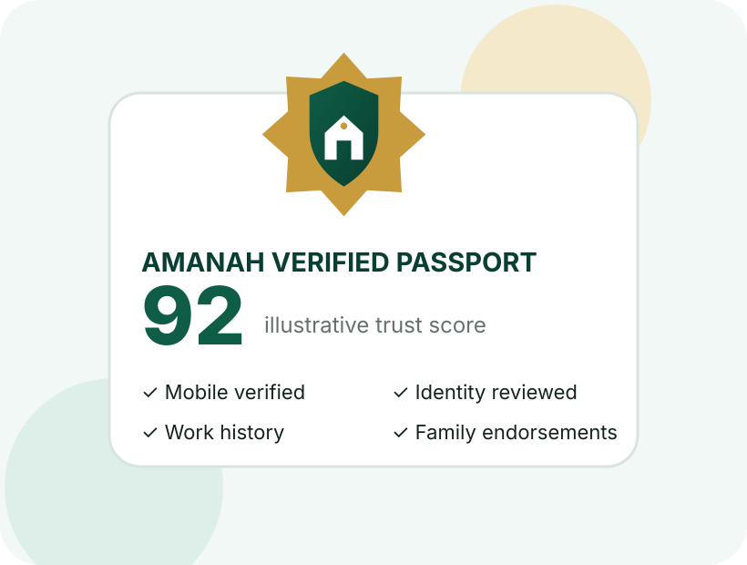

::: {.hero}
::: {.wrap .hero-grid}
::: {.hero-copy}
أمانة: پاکستان کا قابلِ اعتماد خدماتی نیٹ ورکAmanah: Pakistan's trusted workforce network

# ہر خدمت۔ ہر شہر۔ بنیاد اعتماد پر۔Every service. Every city. Built on trust.

أمانة گھرانوں اور اداروں کو تصدیق شدہ خدمت گاروں اور ہنرمند افراد سے جوڑتا ہے۔ اس میں گھریلو مدد، کاریگر، ڈرائیور، تیماردار، نرسیں اور گھر پر صحت کی دیکھ بھال شامل ہیں۔

Amanah connects households and organisations with verified professionals—from household support and skilled trades to drivers, caregivers and home healthcare.

<a class="btnx primary" href="https://amanah-digital-pk.github.io/app/">أمانة ایپ کھولیںOpen Amanah App</a>
<a class="btnx secondary" href="services.html">خدمات دیکھیںExplore services</a>

:::

::: {.hero-art}

:::
:::
:::

::: {.section}
::: {.wrap}
::: {.section-head}
## روزمرہ زندگی کے لیے قابلِ اعتماد مددTrusted help for everyday life

أمانة بڑے اور چھوٹے دونوں شہروں کے لیے بنایا گیا ہے۔ اندراج آسان ہے اور ضرورت کی خدمت تلاش کرنا بھی سیدھا اور واضح ہے۔

Amanah is designed for large metropolitan areas and smaller cities alike, with simple onboarding and accessible service discovery.

:::

::: {.grid4}
::: {.card .service-card}

🏠

### گھریلو مددHousehold support

صفائی، کھانا پکانا، کپڑے دھونا، خریداری میں مدد اور باغبانی۔Cleaning, cooking, laundry, grocery assistance and gardening.
:::

::: {.card .service-card}

🛠️

### ہنرمند کاریگرSkilled trades

الیکٹریشن، پلمبر، بڑھئی، پینٹر، مکینک اور اے سی ٹیکنیشن۔Electricians, plumbers, carpenters, painters, mechanics and AC technicians.
:::

::: {.card .service-card}

🚗

### سفری سہولتMobility

تصدیق شدہ ڈرائیور اور گھر کی طے شدہ سفری ضروریات میں مدد۔Verified drivers and scheduled household transport support.
:::

::: {.card .service-card}

🩺

### دیکھ بھالCare services

بچوں، بزرگوں اور مریضوں کی دیکھ بھال، تیماردار، نرسیں اور گھر پر مدد۔Babysitters, elder-care workers, caregivers, nurses and home attendants.
:::
:::
:::
:::

::: {.section .soft-section}
::: {.wrap}
::: {.section-head}
## اعتماد ہماری بنیادی خدمت ہےTrust is the product—not an afterthought

أمانة آسان اندراج کے بعد شناخت اور کام کی جانچ کو مرحلہ وار مضبوط بناتا ہے۔ ہر فرد کا کام کا ریکارڈ اس کے ساتھ رہتا ہے۔Amanah combines accessible onboarding with stronger verification as professionals build their work history.
:::

::: {.steps}
::: {.step-card}

1

### آسان ابتدائی اندراجAccessible onboarding

موبائل نمبر کی تصدیق، شناختی کارڈ کی تصویر، اسی وقت لی گئی اپنی تصویر، خدمت اور کام کے علاقے کا انتخاب۔Phone verification, CNIC capture, live selfie, service selection and city or working-area registration.

:::

::: {.step-card}

2

### مزید مضبوط تصدیقEnhanced verification

دستیاب ہونے پر سرکاری شناختی جانچ، سابق گھرانے یا ادارے کی تصدیق، اختیاری پولیس تصدیق اور مہارت کے سرٹیفکیٹ۔Approved identity checks when available, employer endorsements, optional police verification and certificates.

:::

::: {.step-card}

3

### ساتھ رہنے والا کام کا ریکارڈPortable reputation

مکمل کیے گئے کام، دوبارہ بلانے والے گھرانے، وقت کی پابندی، مہارتیں اور تصدیق شدہ سفارشات۔Completed jobs, repeat clients, punctuality, skills, certificates and verified household recommendations.

:::
:::
:::
:::

::: {.cta-band}
::: {.wrap .cta-inner}

## أمانة ایپ دیکھیںExperience the Amanah App

خدمات، نمونہ تعارف اور مرحلہ وار تصدیق کا طریقہ دیکھیں۔Browse services, explore demonstration profiles and see the two-stage verification journey.

<a class="btnx light" href="https://amanah-digital-pk.github.io/app/">ایپ کھولیںLaunch app</a>
:::
:::
